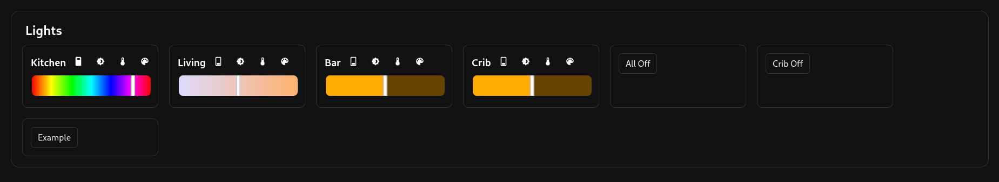

# Igloo

WIP A lightweight, customizable smart home management platform.

## Supported Providers
 1. ESPHome (using my library `esphomebridge-rs`)
 2. MQTT (coming soon)

## Overview
### Hierarchy
 1. Zones
 2. Devices
 3. Entities

Zones are a group of devices which are groups of entities.

Usually a device is its own connection.
For example, you have an ESPHome Light - the connection
to the light is a Device and it contains a few entities:
a light bulb, a safe mode button, an uptime sensor, etc.

### CLI
Igloo is centered around an powerful and intuitive command-line interface.
I have chosen do it this was so there one standard way to interact
with igloo, whether is from the API, front-end, or scripts.

**Examples**:
 - List:
     - `list devices kitchen`
     - `list users`
     - `list entities kitchen.sink`
 - Entity Control:
     - `light all off` -> control all zones
     - `light kitchen off` -> control one zone
     - `light kitchen.sink off` -> control one device
     - `light kicthen.sink.rgbct_bulb off` -> control a specific entity
     - `light kitchen brightness 50`
 - View Logs:
     - `logs system`
     - `logs device kitchen.sink`
     - `logs script example_script`
 - Scripts:
     - `script run example_script`
     - `script cancel 40` -> cancel one script by ID
     - `script cancel_all example_script` -> cancel all running versions of script
 - And more! Note: see the code or CLI help menu for the most up-to-date documentation.

### Configuration File
A big part of Igloo is the declarative configuration file.
The configuration uses `ron` (Rust Object Notation) for its
clear syntax and flexibility. See `example_config.ron`.

The configuration file declares:
 1. Users and User Groups
 2. Permissions (who can access what zones)
 3. Provider Configuration
 4. Devices and Zones
 5. UI Elements
 6. Scripts

### Scripts
Igloo has a very powerful scripting system. Small scripts
can be written straight in the Ron configuration file, and
more advanced scripts can be written in Rust as builtin scripts,
or in Python as external scripts.

Scripts are ran through the CLI.
They can target hard-coded devices/entities or take arguments.

Any scripting, regardless of language, has a bit of metadata:
 1. `auto_run` (default: `false`) -> whether the script should be run at boot
 2. `claims` -> what entities the script controls
 3. `auto_cancel` (default: `true`) -> whether the script should be cancelled if a command conflicts with its claims
    - for example, if this script claims `Light: ["kitchen.sink"]` and the user tries to turn that light off, should it cancel this script or reject their command

### Stack
 - *Frontend*: SolidJS (JS + SCSS)
 - *Backend*: Axum (Rust)
    - API endpoint at `/` which allows one-time login using the authorization header
    - Basic endpoints for front-end (files, `/login`, and `/logout`)
        - Auth tokens are saved in cookies and `tokens.sqlite` and last 30 days
    - Websocket `/ws` for the front-end which allows for syncing state and sending commands

## Usage
This project is currently in Alpha and has no releases.
Future releases will contain all necessary files (including pre built binaries).
 1. Clone repository
 2. Build for target platform
 3. Copy binary, `example_config.ron`, and `web/dist` to computer
 4. Run the binary or create a systemd file
